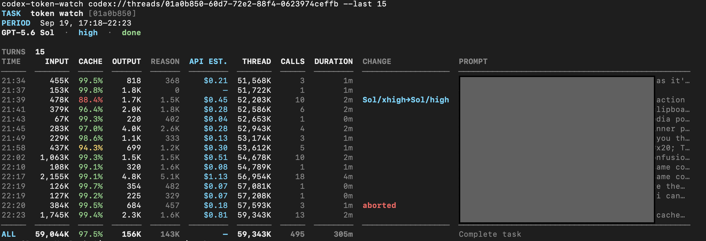
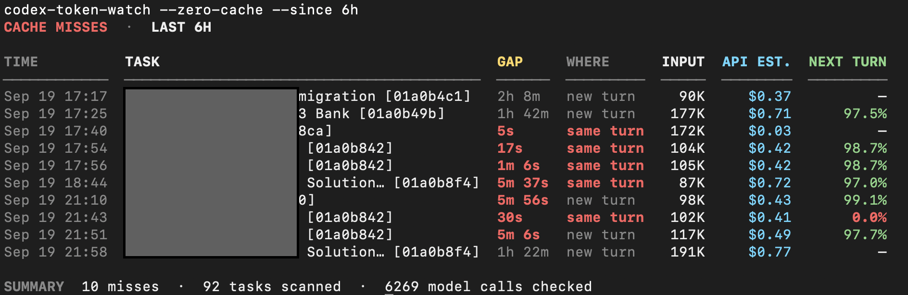

# Codex Token Watch

Saw a lot of discussion around Codex cache hits and had the same confusion, so
I built a small tool for the info and analysis.

Codex Token Watch is a read-only macOS CLI that turns Codex Desktop's local task
logs into per-turn token and prompt-cache reports. It runs only when called and
does not send task data anywhere.

[Current release: v0.3.2](https://github.com/premk134/codex-token-watch/releases/tag/v0.3.2)

## What it shows

- Input, cached, output, and reasoning tokens for each turn
- Model-call count and turn duration
- Model and reasoning-effort changes
- Base API-rate cost comparisons
- Recent turns across tasks by count or time window
- Cache-miss prompts, model settings, and preceding-call gaps

## Screenshots

### Per-turn token analysis



### Cache misses across recent tasks



## Requirements

- macOS
- Codex Desktop with local task history
- Python 3

No third-party Python packages are required.

## Install

```bash
git clone https://github.com/premk134/codex-token-watch.git
cd codex-token-watch
chmod +x codex-token-watch
mkdir -p "$HOME/.local/bin"
ln -s "$(pwd)/codex-token-watch" "$HOME/.local/bin/codex-token-watch"
```

If the command is not found, add this line to `~/.zshrc` and open a new
terminal:

```bash
export PATH="$HOME/.local/bin:$PATH"
```

Check the installation:

```bash
codex-token-watch --version
```

## Quick start

Copy a task link from Codex Desktop. It looks like:

```text
codex://threads/YOUR-TASK-ID
```

Then run one of these commands:

```bash
# Latest 10 turns across tasks
codex-token-watch --last 10

# Every turn from the past 6 hours
codex-token-watch --since 6h

# Hide Luna-only rows but retain their usage in ALL
codex-token-watch --last 10 --hide-luna

# Latest five turns from one task
codex-token-watch codex://threads/YOUR-TASK-ID --last 5

# Every recorded turn from one task
codex-token-watch codex://threads/YOUR-TASK-ID

# Complete cache misses from one task
codex-token-watch codex://threads/YOUR-TASK-ID --zero-cache

# Cache misses across tasks active during the past 24 hours
codex-token-watch --zero-cache

# Cache misses across tasks active during a custom window
codex-token-watch --zero-cache --since 6h
```

`--since` accepts minutes, hours, or days, such as `30m`, `6h`, or `3d`.
For cross-task turn reports, use either `--last` or `--since`, not both.
`--hide-luna` hides Luna-only rows while retaining them in totals. Mixed-model
turns remain visible.
Use `--no-color` for plain output.

## Reading the report

- `INPUT` is the total input across every model call in the turn. It can be
  larger than the model's context window.
- `CACHE` is the percentage of input tokens served from the prompt cache.
- `OUTPUT` excludes reasoning tokens; `REASON` shows them separately.
- `THREAD` is the cumulative token total recorded for the task.
- `ALL` summarizes the complete task in a task report, or the selected turns
  in a cross-task report.
- `NEXT TURN` is the following turn's aggregate cache percentage.
- `MODEL`, `EFFORT`, and `CHANGE` show the turn's settings and any transition
  from the preceding turn.
- `PROMPT` is the user prompt that started the reported turn.
- `API EST.` compares usage using base API rates; it is not a Codex charge.

A complete cache miss means a recorded model call had zero cached input.
Cache-miss reports automatically exclude explicit compaction resets.
Cross-task cache-miss reports also exclude first calls when the preceding call
is not available, because their gap cannot be calculated.

## Privacy, cost, and performance

Codex Token Watch reads local Codex state and rollout files in read-only mode.
It does not modify Codex data, upload task contents, or run in the background.

Cost estimates use base Standard API token rates without the API long-context
multiplier. They are comparisons, not Codex subscription charges or exact API
bills. Tool charges, taxes, subscription entitlements, and Fast/Flex/Batch
adjustments are excluded. Unknown models or incomplete history display `—`.

Embedded prices were checked on 2026-09-24 against the official pages for
[GPT-6 Astra](https://developers.openai.com/api/docs/models/gpt-6-astra),
[GPT-6 Sol](https://developers.openai.com/api/docs/models/gpt-6-sol),
[GPT-6 Luna](https://developers.openai.com/api/docs/models/gpt-6-luna),
[GPT-5.6 Sol](https://developers.openai.com/api/docs/models/gpt-5.6-sol),
[GPT-5.6 Terra](https://developers.openai.com/api/docs/models/gpt-5.6-terra), and
[GPT-5.6 Luna](https://developers.openai.com/api/docs/models/gpt-5.6-luna).

A 57 MB rollout containing 873 model calls was processed in about 0.2 seconds
on the development Mac. Cross-task runtime depends on how many recent tasks are
inside the selected time window.

Codex Desktop's local file format may change in future versions, which could
require an update to this tool.
